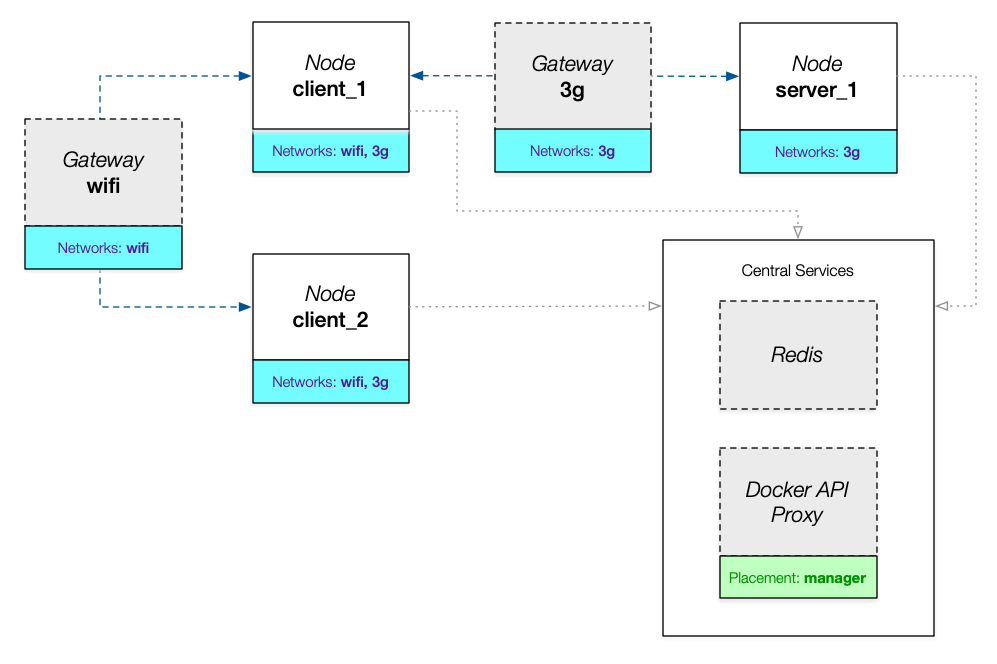

# WoTemu

[](https://hub.docker.com/r/agmangas/wotemu) &nbsp; [](https://travis-ci.com/agmangas/wotemu)

An emulator for Python applications to help in the design of **IoT deployments** based on the **edge computing** model. It is focused on the [Web of Things](https://www.w3.org/WoT/) paradigm by offering extended support for applications programmed with [WoTPy](https://pypi.org/project/wotpy/).

As an emulator, WoTemu demands significantly higher computation resources than simulators in the same domain, it is, however, able to run real code, which simplifies the design process and provides more meaningful insights into the target architecture.

The main output of an emulation experiment is an HTML report describing the observed behaviour of the stack. Please see a [demo report here](https://agmangas.github.io/demo-wotemu-report/).

## Design

This project leverages [Docker Swarm Mode](https://docs.docker.com/engine/swarm/) to offer simple horizontal scaling across heterogeneous nodes; this enables the emulation of scenarios with hundreds of actors.

The following image shows a high-level view of a simple emulation stack. This serves to illustrate the main design choices behind WoTemu.



- All communications for the supported protocols (HTTP, CoAP, Websockets and MQTT) go through the network **gateways**; these use NetEm to shape the traffic and emulate real network conditions. This redirection is based on _iptables_ and is invisible to the application.
- All **nodes** report their metrics to a central Redis store in a periodic fashion; this will be later used to build the final HTML report.
- Thanks to the capabilities of Docker Swarm, multiple replicas of a single node can be created easily and will automatically recover from errors. **Nodes** could be interpreted as _templates_, while each replica is an actual real instance of the node.
- A **Docker API proxy** service based on [Tecnativa/docker-socket-proxy](https://github.com/Tecnativa/docker-socket-proxy) is always deployed in a _manager_ node to enable **nodes** to access stack metadata (e.g. container IDs of other nodes in the same network).

## System requirements

* Python 3.6+
* Docker Engine 20.10.0+ ([swap limit capabilities should be enabled](https://docs.docker.com/engine/install/linux-postinstall/#your-kernel-does-not-support-cgroup-swap-limit-capabilities))
* Docker Compose 1.27.0+
* [Pumba](https://github.com/alexei-led/pumba) 0.7.0+
* [WoTemu](https://pypi.org/project/wotemu/) (install with _pip_: `pip install wotemu`)

> Such a recent version of the Docker Engine is required to ensure that `cap_add` is supported in Swarm Mode.

## Quickstart

Emulation experiments are represented by instances of `wotemu.topology.models.Topology`.

The recommended workflow to run an experiment is as follows:

1. Create a `Topology`.
2. Build the Compose file that describes the stack of that `Topology`.
3. Run the stack on the Docker Swarm cluster.
4. Stop the stack after an arbitrary amount of time.
5. Build the final report from the collected data contained in the central Redis store.

> Please note that the commands in this section should be executed in a Swarm _manager_.

### (Optional) Create a development Swarm cluster

There is a [Vagrant](https://www.vagrantup.com/) configuration file (`Vagrantfile`) in this repository that may be used to quickly create a Swarm cluster consisting of three virtual machines (one _manager_ and two _workers_) for development and test purposes. All dependencies for WoTemu are installed in the [provision stage](https://www.vagrantup.com/docs/provisioning).

Run `vagrant up` in your host to create and provision the three guest machines. Please note that you must manually run the `/vagrant/scripts/join-swarm.sh` script once in both `worker1` and `worker2` to join the swarm.

### Describe the topology

Topologies can be defined in a Python file exposing a `topology` function that takes no arguments and returns an instance of `Topology`. The following is such an example:

```python
from wotemu.enums import NetworkConditions
from wotemu.topology.models import (BuiltinApps, Network, Node, NodeApp,
                                    NodeResources, Topology)

_SERVER_GIST = "https://gist.github.com/agmangas/94cc5c3d9d5dcb473cff774b3522bbb6/raw"


def topology():
    network_3g = Network(
        name="3g",
        conditions=NetworkConditions.REGULAR_3G)

    node_server = Node(
        name="server",
        app=NodeApp(path=_SERVER_GIST, http=True),
        networks=[network_3g],
        scale=1)

    host_server = "{}.{}".format(
        node_server.name,
        network_3g.name)

    app_reader = NodeApp(
        path=BuiltinApps.READER,
        params={
            "servient_host": host_server,
            "thing_id": "urn:wotemu:quickstart:thing"
        })

    node_reader = Node(
        name="reader",
        app=app_reader,
        networks=[network_3g],
        resources=NodeResources(mem_limit="150M"),
        scale=4)

    topology = Topology(nodes=[
        node_server,
        node_reader
    ])

    return topology
```

There are two types of nodes here:

- The _reader_ uses the `READER` _built-in_ application, which takes a WoTPy Servient index URL (`servient_host`) and Thing ID (`thing_id`) as arguments and periodically reads all properties exposed by the Thing; this particular instance of `READER` is connected to the _server_ node. All replicas of _reader_ are constrained to 150MB of memory.
- The _server_ uses a [custom application defined in a remote HTTP URL](https://gist.github.com/agmangas/94cc5c3d9d5dcb473cff774b3522bbb6) that exposes a Thing with two properties.

Both nodes are connected in a network that uses the `REGULAR_3G` network conditions. The four replicas of _reader_ will periodically read both properties from the single replica of _server_ on a channel that displays the typical latency and bandwidth of a 3G connection.

#### Applications

An _application_ (i.e. the code run by a `Node`) is a Python file that exposes an _asynchronous_ `app` function that takes at least three positional arguments:

| Variable | Type                        | Description                                                  |
| -------- | --------------------------- | ------------------------------------------------------------ |
| `wot`    | `wotpy.wot.wot.WoT`         | WoTPy WoT entrypoint decorated and pre-configured by WoTemu. |
| `conf`   | `wotemu.config.EnvConfig`   | Environment configuration that is currently active.          |
| `loop`   | `asyncio.AbstractEventLoop` | Loop that is running the application.                        |

The `path` parameter of a `NodeApp` instance should point to an _application_. There are three distinct options when setting the value of `path`:

* Using a WoTemu built-in application (e.g. `BuiltinApps.READER`).
* Using a remote HTTP URL.
* Using a local file path.

Loading applications from the filesystem of a custom Docker image based on [agmangas/wotemu](https://hub.docker.com/r/agmangas/wotemu) is arguably the **most versatile option**. To that end, you may use the optional `image` parameter in the `Node` class (set to `agmangas/wotemu:latest` by default).

### Deploy the stack

A Compose file describing the emulation experiment can be created automatically from a topology file using the `wotemu compose` CLI command:

```
wotemu compose --path ./examples/quickstart.py
```

This stack may then be deployed to the Swarm cluster in the usual fashion:

```
docker stack deploy -c ./examples/quickstart.yml quickstart
```

### Build the final report

Metrics such as network packets, interactions or system usage data points will be periodically collected while the stack is active. The emulation stack can be stopped when the user considers that enough time has passed to gather a significant amount of data for the experiment:

```
wotemu stop --compose-file ./examples/quickstart.yml --stack quickstart
```

> It is necessary to stop the stack with `wotemu stop` instead of `docker stack rm` to capture a final snapshot of the stack state and keep the Redis store online.

An HTML report containing useful insights into the behaviour of the emulation stack can be then generated with the following command.

```
wotemu report --out /report/ --stack quickstart
```
